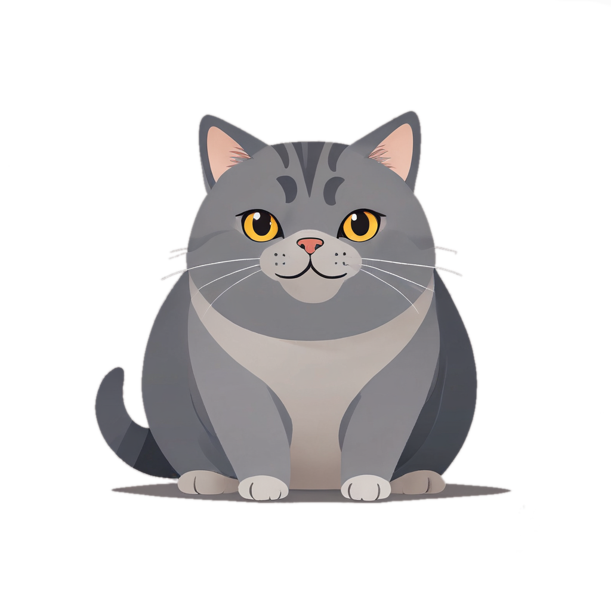
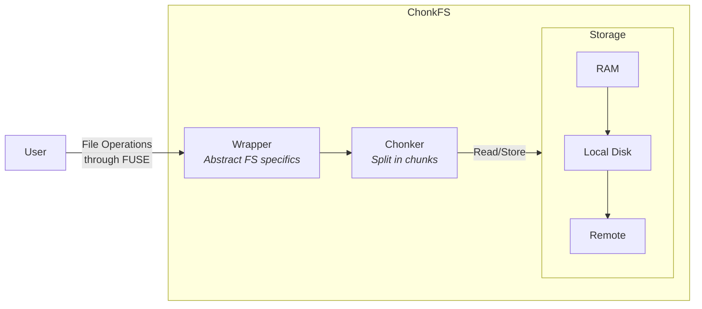

# ChonkFS

FUSE file-system that split files in chunks and save them remotely.
Made for protocols such as torrent based systems. 

    

    Chonkers are cats, and all cats are liquids that fit anywhere, disregard of their chonkiness. Just like this file-system.

## Architecture

The file-system is divided in three main components:

