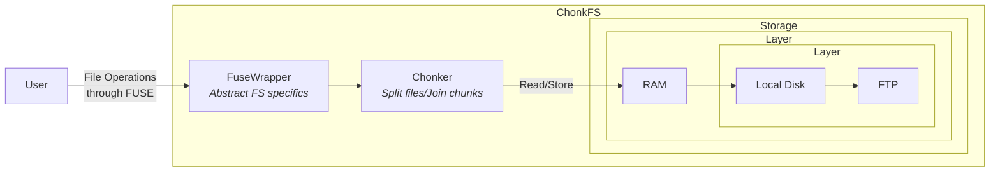

# ChonkFS

FUSE file-system that split files in chunks and save them remotely.
Made for protocols such as torrent based systems. 

<i>Chonkers are cats, and all cats are liquids that fit anywhere, disregard of their chonkiness.</i>

<i>Just like this file-system.</i>

*Based on the incredible [go-fuse](https://github.com/hanwen/go-fuse) library.*

## Architecture

The file-system is divided in three main components:

## Storage

* Memory (RAM): Implemented
* Disk: Implemented
* FTP: TODO
* S3: TODO